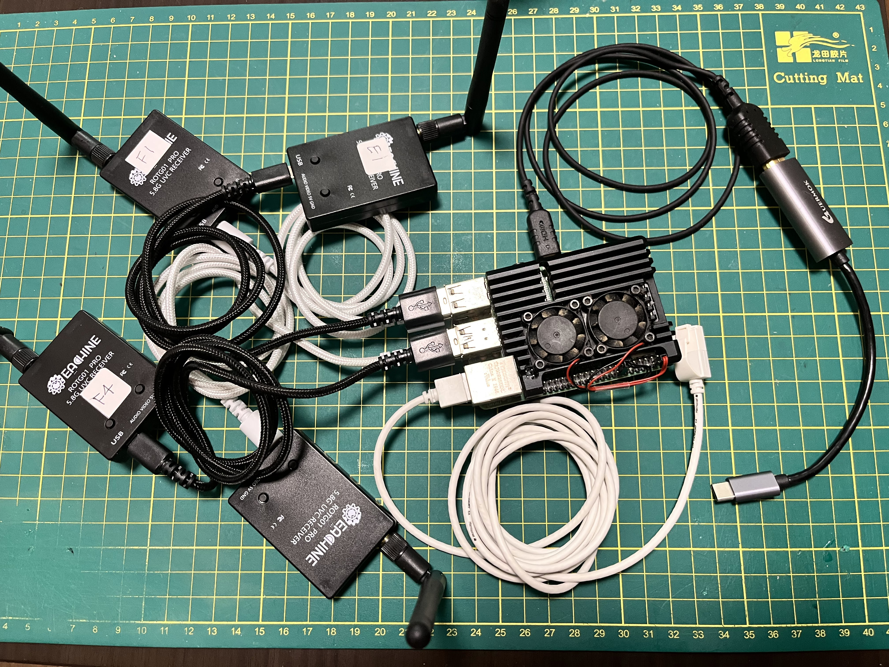

# raspi4eyes

[English](#english) | [日本語](#日本語)

---

# English

A Python-based utility for Raspberry Pi to capture up to 4 UVC video inputs (typically FPV drone receivers like EACHINE ROTG01 PRO) and tile them in a 2x2 grid layout on a single HDMI output.  
*(Tested and verified on **Raspberry Pi 4B** and **Raspberry Pi 5**. Also runs on **Windows 10/11**.)*

This project aims to replicate a multi-receiver display system similar to the **HDZero Event VRX** or **Hawkeye Firefly Four Eyes**.

## Hardware Layout


## Key Features

- **Low-Latency Multi-Threading**: Captures each camera stream in a separate thread. This prevents frame blockages and ensures smooth, low-latency rendering.
- **No-Signal Blackout (Anti-Static Screen)**: When a drone is powered off, the receiver outputs static snow noise. This tool analyzes the frames and replaces the static noise with a clean black screen.
  - *HDZero Event VRX Style*: Modeled after the similar black-screen feature of the HDZero Event VRX.
  - *ArUco Optimization (CPU Load & False Detections)*: When using tracking software like **FPVTrackSide**, static noise forces the image processor to scan millions of random edges, causing CPU spikes and dropping the system's processing FPS. Suppressing the noise into a flat black screen dramatically reduces CPU load and stabilizes the overall frame rate.
- **Cross-Platform (Linux & Windows)**: Automatically selects the capture backend per OS (V4L2 on Linux, DirectShow on Windows). On Windows, cameras are selected and followed by **device name**.
- **Robust Auto-Reconnect**: Automatically attempts to reconnect to devices if they are disconnected mid-run or not powered on at startup.
- **Bandwidth Band-aid (MJPEG)**: Forces MJPEG capture format to bypass the USB controller bandwidth limitation (`No space left on device`) common on Raspberry Pi.
- **Text-Configurable**: Easily tweak device paths, window modes, noise levels, and resolutions using a JSON configuration file.

---

## Prerequisites & Installation

### 1. Build a Python Virtual Environment (venv)
It is recommended to run the script inside a Python Virtual Environment (`venv`) to avoid package conflicts on Raspberry Pi OS.

```bash
# Clone the repository and navigate into it
cd ~/rasp4eyes

# Create a virtual environment named '.venv'
python3 -m venv .venv

# Activate the virtual environment
source .venv/bin/activate
```

### 2. Install Dependencies
Install the required packages (`opencv-python` and `numpy`) inside the active virtual environment:

```bash
pip install -r requirements.txt
```

*Note: If you prefer to install packages globally via apt:*
```bash
sudo apt update
sudo apt install -y python3-opencv python3-numpy
```

### Windows

The same script also runs on Windows using the **DirectShow** backend. Cameras are selected by **device name** instead of `/dev/video*` paths.

```powershell
# In the project folder (PowerShell)
python -m venv .venv
.\.venv\Scripts\Activate.ps1
pip install -r requirements.txt
python raspi4eyes.py
```

Or use the included batch files:

- **`setup.bat`** — creates the venv and installs dependencies (run once)
- **`run.bat`** — launches the app (arguments pass through, e.g. `run.bat --windowed`)

Notes:
- `DISPLAY=:0` is **not** required on Windows.
- Camera enumeration uses **`pygrabber`**, which is installed automatically by `requirements.txt` on Windows.
- If PowerShell blocks `Activate.ps1`, run `Set-ExecutionPolicy -Scope CurrentUser RemoteSigned` once.

---

## Usage

Ensure the virtual environment is active before running the script:

```bash
# Make sure display env is specified, especially when starting via SSH
# If needed, ensure XAUTHORITY is set
export XAUTHORITY=~/.Xauthority
DISPLAY=:0 python raspi4eyes.py
```
*Specifying `DISPLAY=:0` is critical for OpenCV to access the X11/Wayland display server when executing from an SSH terminal or automated scripts. (On Windows this is not needed — just `python raspi4eyes.py` or `run.bat`.)*

### Key Bindings
- Press `q` or `ESC` in the display window to safely stop the threads and exit the program.

### CLI Options
```bash
# Force windowed mode (overrides config.json)
DISPLAY=:0 python raspi4eyes.py --windowed

# Show real-time noise measurements for calibration
DISPLAY=:0 python raspi4eyes.py --debug-noise
```

---

## Configuration (`config.json`)

On the first execution, `config.json` will be automatically generated.

```json
{
    "devices": [
        "/dev/video0",
        "/dev/video2",
        "/dev/video4",
        "/dev/video6"
    ],
    "width": 640,
    "height": 480,
    "fps": 30,
    "fullscreen": true,
    "use_mjpeg": true,
    "show_no_signal_text": true,
    "detect_noise": true,
    "noise_threshold": 0.4
}
```
*On Windows, the generated `devices` default to numeric indices (`[0, 1, 2, 3]`) and a `"windows_device_name"` key is added (see below).*

### Settings Table

| Key | Description | Default |
| :--- | :--- | :--- |
| `devices` | List of video device paths or index numbers. | `["/dev/video0", ...]` |
| `windows_device_name` | **(Windows only)** Camera name to auto-select (substring match). The top 4 matching cameras are used and followed by name at runtime; ignored on Linux. | `"USB2.0 PC CAMERA"` |
| `width` / `height` | Capture resolution for each camera. | `640` / `480` |
| `fullscreen` | Start the application in fullscreen mode. | `true` |
| `use_mjpeg` | Request MJPEG compression to save USB bandwidth. | `true` |
| `detect_noise` | Automatically detect static noise and blackout the grid. | `true` |
| `noise_threshold` | Threshold ratio for static noise detection (`0.0` - `1.0`). | `0.4` |

> **Windows device selection**: When `windows_device_name` is set, the app lists all DirectShow cameras at startup, selects up to 4 whose name contains that string, and keeps **following them by name at runtime** (handling reconnects and cameras plugged in later). It does **not** fall back to numeric indices. Set `windows_device_name` to `""` to use the numeric `devices` list instead.

---

## Important Operational Tips

### 1. FPV Video Transmitter (VTX) Wi-Fi Interference
Drone video transmitters (VTX) emit powerful signals on the **5.8GHz band**. If your Raspberry Pi is connected to the network via **5GHz Wi-Fi**, the close proximity of VTX antennas can completely blind the Pi's Wi-Fi chip, resulting in lost SSH connections.
- **Recommendation**: Always use a **wired Ethernet connection** for test environments and live events to guarantee system stability.

### 2. Resolution Settings for Image Recognition (FPVTrackSide)
When piping this tiled output into timing systems like **FPVTrackSide** for ArUco marker tracking, image clarity is critical.
- **Best Practice**: To maximize tracking accuracy, choose a screen resolution that prevents scaling distortions. A resolution of **`1280x960 @ 60Hz`** is highly recommended. Because it has a 4:3 aspect ratio, the four 640x480 native feeds fit perfectly into a 2x2 grid without stretching or loss of pixel integrity.

### 3. Tuning the Noise Threshold
The noise logic measures the contrast ratio before and after blurring the frame.
- **Static Snow Noise / No Signal**: Ratio is very low (`0.01` to `0.07`).
- **Active Video**: Ratio is high (`0.60` to `0.85`).
If your receivers fail to blackout or get stuck on a black screen, run with `--debug-noise` and adjust `"noise_threshold"` in `config.json` accordingly (Default: `0.4`).

---

## Headless & Turnkey System Documentation

For production environments where the Raspberry Pi runs without a desktop environment (headless) and serves as an autonomous display receiver (turnkey system), refer to the following guides in the `doc/` directory:

- [**Cage Setup Guide (Headless Execution)**](doc/cage_setup_guide_en.md): Detailed configuration to launch `raspi4eyes` using the Cage Wayland kiosk compositor directly on the DRM/KMS backend (X11/Wayland-free setup, resolving screen shift issues, and systemd service creation).
- [**OverlayFS Setup Guide (Turnkey System Protection)**](doc/overlayfs_setup_guide_en.md): Steps to enable a read-only filesystem (OverlayFS) to protect the SD card from corruption when powering down without a safe shutdown.

---

# 日本語

Raspberry Piで最大4つのUVCビデオ入力（EACHINE ROTG01 PROなどのFPVドローン用受信機）をキャプチャし、HDMI出力に2x2のグリッド配置で並べて表示するPythonプログラムです。  
*(**Raspberry Pi 4B** および **Raspberry Pi 5** にて実機動作確認済み。**Windows 10/11** でも動作します。)*

**HDZero Event VRX** や **Hawkeye Firefly Four Eyes** のような、イベントやレース向けの複数受信機表示画面を構築することを目的としています。

## ハードウェア構成


## 主な機能

- **低遅延マルチスレッド**: 各カメラのストリーム取得を個別のスレッドで非同期に行うため、一部のカメラのフレーム遅延や引っ掛かりが画面全体の描画に影響しません。
- **無信号時の黒画面化（砂嵐の除去）**: ドローン本体の電源が切れている時、受信機は砂嵐（スノーノイズ）を出力します。本ツールは画像解析でノイズを検知し、自動的に該当画面を綺麗な黒画面（「No Signal」）に置き換えます。
  - *HDZero Event VRX仕様*: 同種製品であるHDZero Event VRXの無信号時黒画面化機能を目標に設計。
  - *ArUcoトリガーの最適化（処理負荷軽減と誤検出防止）*: **FPVTrackSide** などの画像認識エンジンに入力する際、砂嵐画面に対して画像認識を実行すると、無数のノイズが輪郭（エッジ）と判定されてCPU負荷が跳ね上がり、システム全体のFPSが著しく低下してしまいます。無信号部分を平坦な黒画面にすることで、画像処理負荷を劇的に軽減し、FPSを安定・維持させます。
- **クロスプラットフォーム対応 (Linux / Windows)**: OSに応じてキャプチャバックエンドを自動選択します（Linux=V4L2、Windows=DirectShow）。Windows ではカメラを**デバイス名**で選択・追従します。
- **自動再接続機能**: 起動時にデバイスが接続されていない場合や、動作中にケーブルが抜けた場合でも、自動的にデバイスの再初期化・再接続を試み続けます。
- **USB帯域幅の制限対策 (MJPEG)**: Raspberry Piで複数カメラ接続時に発生しやすい帯域不足エラー（`No space left on device`）を避けるため、MJPEG圧縮形式での入力を優先します。
- **JSONによる簡単な設定**: デバイスパス、表示解像度、ウィンドウ設定、砂嵐の感度などを `config.json` から変更可能です。

---

## 導入手順

### 1. Python仮想環境 (venv) の構築
Raspberry Pi OSのシステム環境のパッケージと競合するのを防ぐため、Pythonの仮想環境（`venv`）を構築して実行することを強く推奨します。

```bash
# リポジトリのディレクトリへ移動
cd ~/rasp4eyes

# '.venv' という名前で仮想環境を作成
python3 -m venv .venv

# 仮想環境を有効化
source .venv/bin/activate
```

### 2. 依存パッケージのインストール
仮想環境が有効な状態で、必要な依存パッケージ（`opencv-python`, `numpy`）をインストールします。

```bash
pip install -r requirements.txt
```

*※システム全体にaptでインストールしたい場合:*
```bash
sudo apt update
sudo apt install -y python3-opencv python3-numpy
```

### Windows

同じスクリプトは Windows でも動作し、**DirectShow** バックエンドを使用します。カメラは `/dev/video*` パスではなく**デバイス名**で選択します。

```powershell
# プロジェクトフォルダ内で (PowerShell)
python -m venv .venv
.\.venv\Scripts\Activate.ps1
pip install -r requirements.txt
python raspi4eyes.py
```

付属のバッチファイルでも実行できます:

- **`setup.bat`** — venv作成と依存パッケージのインストール（初回のみ）
- **`run.bat`** — アプリ起動（引数はそのまま渡されます。例: `run.bat --windowed`）

補足:
- Windows では `DISPLAY=:0` は不要です。
- カメラ列挙には **`pygrabber`** を使用し、Windows では `requirements.txt` で自動インストールされます。
- PowerShell で `Activate.ps1` が拒否される場合は、一度 `Set-ExecutionPolicy -Scope CurrentUser RemoteSigned` を実行してください。

---

## 使用方法

実行する際は、仮想環境が有効になっていることを確認してください。

```bash
# SSH接続経由などで実行する場合、DISPLAYを指定して起動します
# 必要に応じて、XAUTHORITYの設定が必要な場合があります
export XAUTHORITY=~/.Xauthority
DISPLAY=:0 python raspi4eyes.py
```
*※ `DISPLAY=:0` の指定は、SSHターミナルや自動起動スクリプトからOpenCVを実行し、X11/Waylandディスプレイサーバー上にウィンドウを表示するために必須です。（Windows では不要で、`python raspi4eyes.py` または `run.bat` で起動します。）*

### 操作方法
- 表示ウィンドウ上で `q` キーまたは `ESC` キーを押すと、すべてのスレッドを安全にクリーンアップして終了します。

### コマンドラインオプション
```bash
# ウィンドウ表示で起動する（config.jsonの設定より優先）
DISPLAY=:0 python raspi4eyes.py --windowed

# 砂嵐検知用の測定数値をリアルタイム表示する（閾値の調整用）
DISPLAY=:0 python raspi4eyes.py --debug-noise
```

---

## 設定ファイル (`config.json`)

初回実行時に、プログラムと同じディレクトリにデフォルト設定の `config.json` が自動生成されます。

```json
{
    "devices": [
        "/dev/video0",
        "/dev/video2",
        "/dev/video4",
        "/dev/video6"
    ],
    "width": 640,
    "height": 480,
    "fps": 30,
    "fullscreen": true,
    "use_mjpeg": true,
    "show_no_signal_text": true,
    "detect_noise": true,
    "noise_threshold": 0.4
}
```
*※ Windows では `devices` の既定値が数値インデックス（`[0, 1, 2, 3]`）になり、`"windows_device_name"` キーが追加されます（下記参照）。*

### 設定項目一覧

| 項目名 | 説明 | デフォルト値 |
| :--- | :--- | :--- |
| `devices` | キャプチャするビデオデバイスのパスまたは番号のリスト。 | `["/dev/video0", ...]` |
| `windows_device_name` | **(Windowsのみ)** 自動選択するカメラのデバイス名（部分一致）。一致した上位4台を使用し、実行時も名前で追従する。Linuxでは無視。 | `"USB2.0 PC CAMERA"` |
| `width` / `height` | 各カメラのキャプチャ解像度。 | `640` / `480` |
| `fullscreen` | フルスクリーン表示で起動するか。 | `true` |
| `use_mjpeg` | USB帯域幅を節約するため、MJPEG圧縮を要求するか。 | `true` |
| `detect_noise` | 砂嵐（ノイズ）の検知・自動黒画面化を有効にするか。 | `true` |
| `noise_threshold` | 砂嵐を判定する閾値比率（`0.0` 〜 `1.0`）。 | `0.4` |

> **Windowsのデバイス選択**: `windows_device_name` を設定すると、起動時に全 DirectShow カメラを列挙し、名前にその文字列を含むカメラを最大4台選択して、**実行時も名前で追従**します（再接続や後から接続したカメラにも対応）。インデックス番号へはフォールバックしません。数値の `devices` を使いたい場合は `windows_device_name` を `""` にしてください。

---

## 運用上の重要なヒントと注意点

### 1. FPV送信機（VTX）によるWi-Fi電波干渉について
ドローンの映像送信機（VTX）は極めて強力な **5.8GHz帯** の電波を発信します。Raspberry PiへのSSH接続などに **5GHz帯のWi-Fi** を使用している場合、機体が近づいた際にWi-Fiモジュールが強烈な電波干渉を受け、SSH接続が完全に切断されてしまう場合があります。
- **推奨対策**: 安定した運用およびテストのために、実戦・イベントでの使用時は必ず **有線LAN（イーサネット）** で接続することを強く推奨します。

### 2. 画像判定（FPVTrackSide）のための解像度設定について
出力映像を **FPVTrackSide** 等に入力してArUcoマーカーの画像認識を行う場合、アスペクト比の歪みや引き伸ばしがあると、マーカーの検出精度が著しく低下します。
- **推奨解像度**: アスペクト比が 4:3 になる **`1280x960 @ 60Hz`** をディスプレイ解像度に設定することを強く推奨します。これにより、EACHINE ROTG01 PROのネイティブ解像度である 640x480 映像が引き伸ばされることなく、ドット・バイ・ドットで2x2グリッドにピッタリと配置され、最高の認識精度を得ることができます。

### 3. 砂嵐（ノイズ）閾値の調整について
本プログラムのノイズ検知は、画像を強くぼかした前後のコントラスト比を算出しています。
- **砂嵐 / 無信号のとき**: ぼかすと明暗差が消滅するため、比率は **`0.01 〜 0.07`** のように極小になります。
- **正常映像のとき**: ぼかしても全体的な明暗差が残るため、比率は **`0.60 〜 0.85`** 程度になります。
受信機が黒画面に切り替わらない場合や、逆に正常な映像が映らない場合は、`--debug-noise` オプションで数値を観察し、`config.json` の `"noise_threshold"` を微調整してください（初期値: `0.4`）。

---

## ヘッドレス・ターンキーシステム向けドキュメント

X11/Waylandデスクトップ環境を起動しないヘッドレス運用や、電源ボタン長押し等での直抜き対応（ターンキーシステム）を構築するための詳細手順書を `doc/` ディレクトリに同梱しています。

- [**Cage導入・ヘッドレス起動手順書**](doc/cage_setup_guide_ja.md): 超軽量Waylandコンポジタ「Cage」を使用してDRM/KMS上で直接映像出力する設定、画面ズレの対策、および `systemd` によるOS自動起動サービス化の手順。
- [**OverlayFS（リードオンリー化）設定手順書**](doc/overlayfs_setup_guide_ja.md): 突然の電源オフでもSDカードのファイルシステムが破損しないよう、`raspi-config` からOverlay File Systemを有効化・無効化する手順。
